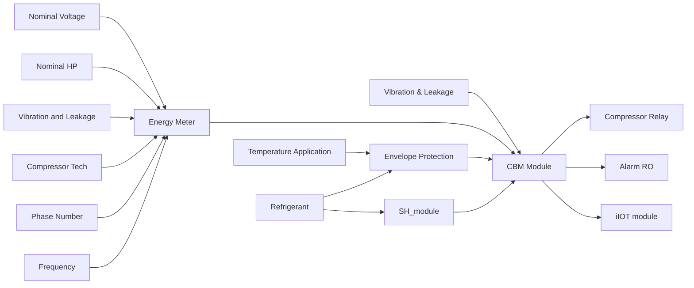

# Symbionte UN
iot-HVAC&R protection module based on ESP32 to Azure IoT Central using the Azure SDK for C Arduino library
**Total completion time**:  4 hours (included calibration)

```mermaid
graph LR
Refrigerant[Refrigerant] --> SH_module[SH_module]
Nominal_Voltage[Nominal Voltage] --> Energy_Meter[Energy Meter]
Nominal_Horsepower[Nominal HP] -->  Energy_Meter
Vibration_&_Leakage[Vibration and Leakage] --> Energy_Meter
Compressor_Technology[Compressor Tech] --> Energy_Meter
Phase_Number[Phase Number] --> Energy_Meter
Frequency[Frequency] --> Energy_Meter
Temperature_Application[Temperature Application] --> Envelope_Protection[Envelope Protection]
Refrigerant  --> Envelope_Protection
Vibration_Leakage[Vibration & Leakage] --> CBM_Module[CBM Module]
Energy_Meter ----> CBM_Module
Envelope_Protection --> CBM_Module
SH_module --> CBM_Module
CBM_Module --> Compressor_RO[Compressor Relay]
CBM_Module --> Alarm_RO[Alarm RO]
CBM_Module --> iIOT_Module[iIOT module]
```

