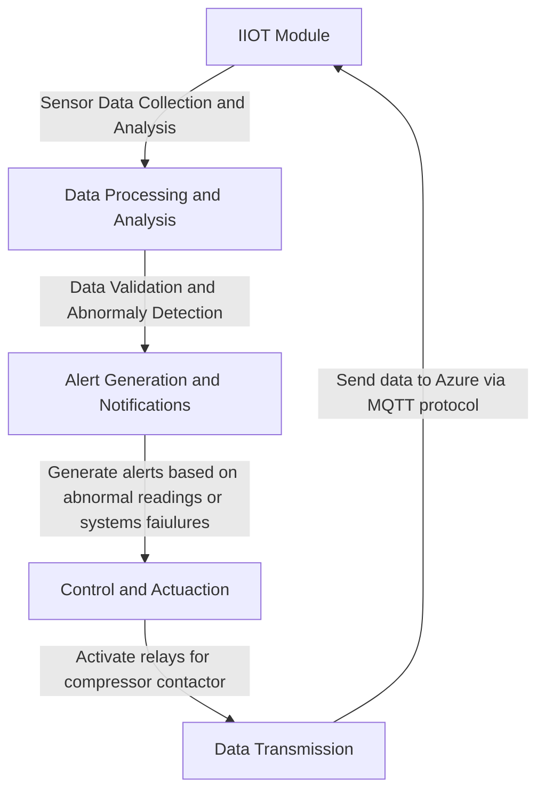
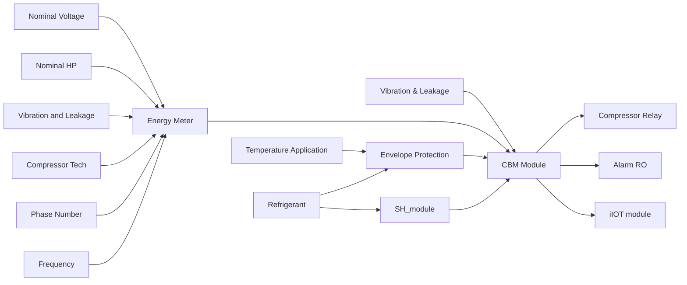
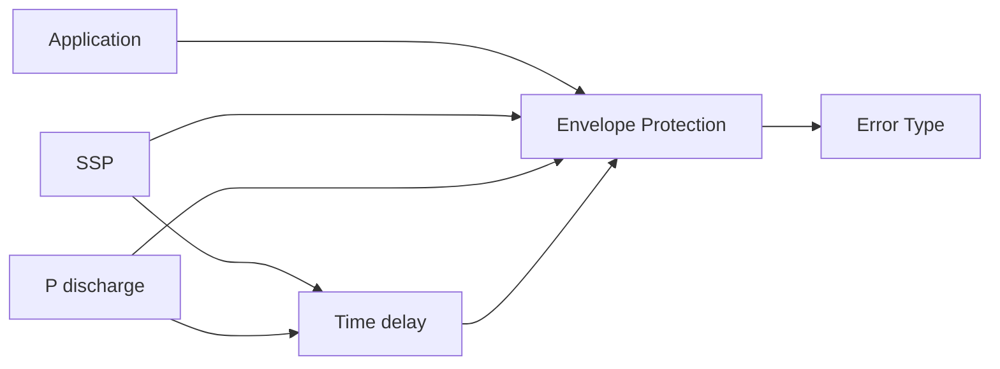
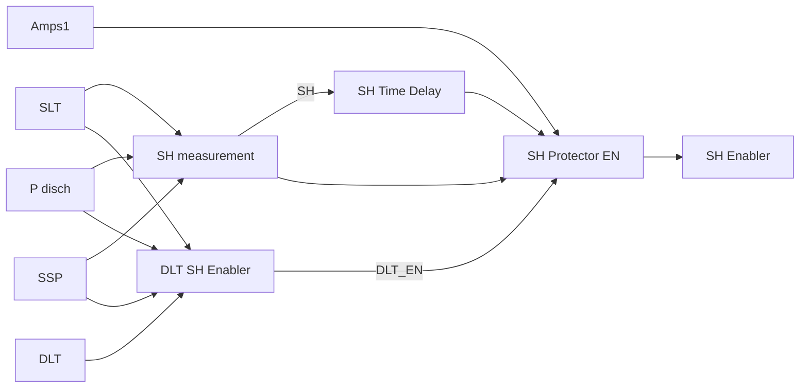
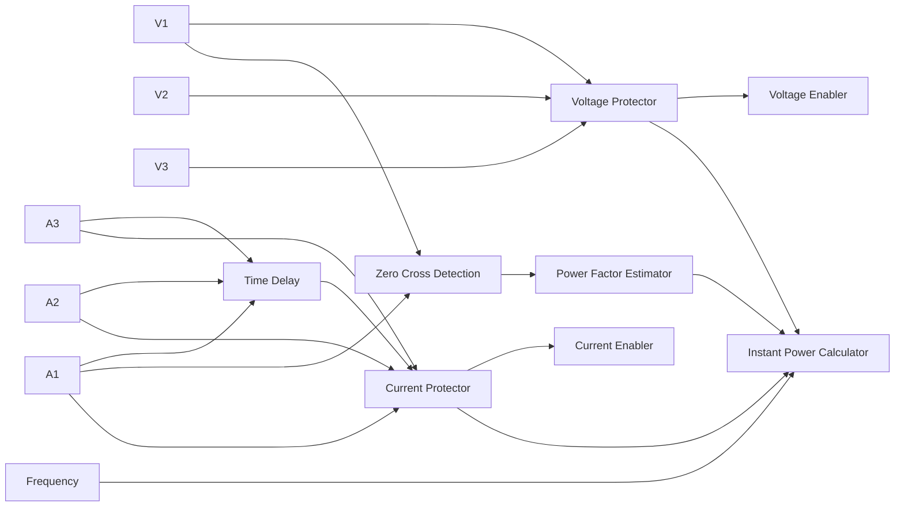
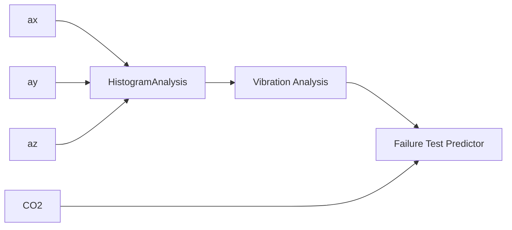
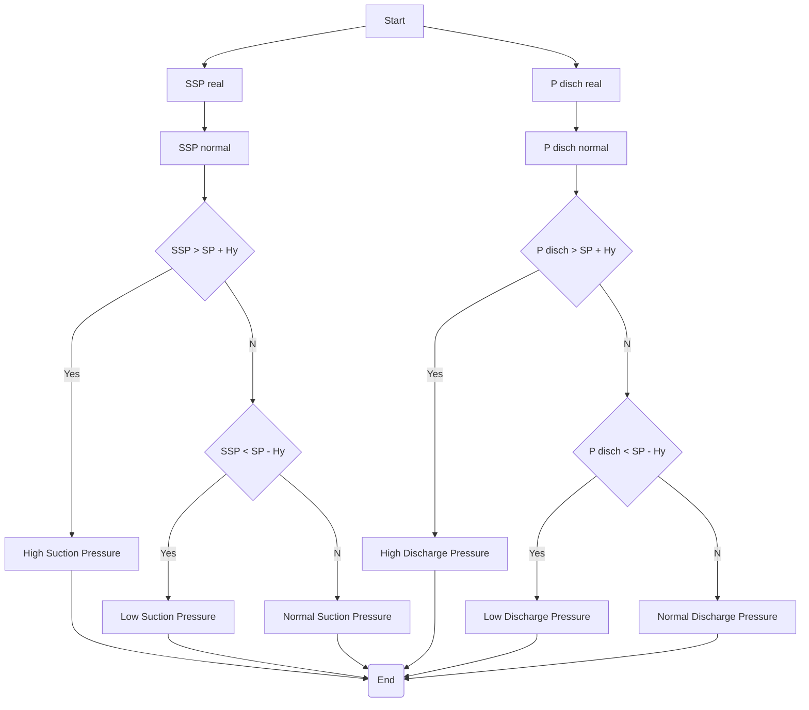

# Symbionte UN
IOT-HVAC&R protection module based on ESP32 to Azure IoT Central using the Azure SDK for C Arduino library

## Abstract
This project addresses the problem of correct diagnosis of compressors for air conditioning and refrigeration systems, using instrumentation easily found in the global market in order to be low-cost, accessible and easy to assembly and diagnose, for all kind of users. For this work, the use of an Espressif ESP32 controller compatible with Arduino language and connected to Microsoft Azure is proposed, as well as algorithms based on trends that provide to different users, basic and advanced, with real-time knowledge of relevant variables and failures detected in the refrigeration process allows anticipating them under an enhanced condition-based maintenance scheme, reducing incorrect diagnoses and system downtime while improve capabilities for a better failure troubleshooting, control over spare parts and the reduction of spoiled product. Also, in order to massify this solution, this device can be used as an input with system data to generate relevant information to a recurrent neural network which diagnose, not only compressors but the complete system as well, under two significant variables which are coefficient of performance and mass flow.

## Scope
- Electrical values: Compression system is coupled to an electric motor that is cooled (many times) by the refrigerant substance.
  - Power supply parameters (Voltage)
  - Consumption parameters (Current)
  - Efficiency measurement (Power and power factor)
- Thermodynamic values: The compressor increases the pressure (due to the reduction in volume) to transport refrigerant gas through the pipeline.
  - Since a pressure/temperature drop across the TXV/EXV (Thermostatic or Electronic Expansion Valve) is essential to the system.
  - Measurement of superheat and avoid liquid returns or migrations to the compressor.
  - Knowing the efficiency of the compressor based on the COP/EER (Coefficient of Performance/ Energy Efficiency Ratio)
- Vibration and CO2 levels: This approach seeks to measure signs of excessive vibration and levels of displacement of the CO2 level to estimate the possibility of refrigerant leakage in the compressor or surrounding systems.
**Total completion time**:  4 hours (included calibration)

Besides, sensor input modules have user-predefined configurations, such as unit preferences for temperature and pressure. Compressor technology enables a specific set of failures based on nominal horsepower, electrical parameters, and temperature application that adjust the linear regression parameters for electrical monitoring and protection.

All code implemented in the present work has been developed in the Arduino IDE and the microcontroller device Espressif ESP32. In this case, the development work and future works are Arduino Compatible.

## Envelope/Temperature Module
The operating envelope of the compressor allows maintenance personnel to identify failures of some system components that may be affecting the performance of the equipment through operation or causing production losses associated with the cold room. The envelope module allows identifying four main conditions, and the interaction between them can yield more information to the maintenance personnel:
 

Code also determines the vector to be loaded based on the application temperature and refrigerant. Following, if the operating point compared to a boundary (set point and hysteresis) (whether evaporation or condensation) is higher (+1), lower (-1) or inside (0). The optimal conditions (boundaries) were obtained by performing several searches in public manufacturing databases and cross-referencing that information to determine an average zone for protection.

| Nominal| RTOS Code | Description |
| :---   | :---:     | :---        |
| ENV0    | 10        | Normal Operation |
| ENV1    | 11        | Low Evaporation and High Discharge Pressures |
| ENV2    | 12        | High Discharge  Pressure |
| ENV3    | 13        | High Evaporation and High Discharge Pressures |
| ENV4    | 14        | High Evaporation Pressure |
| ENV5    | 15        | High Evaporation and Low Discharge Pressures |
| ENV6    | 16        | Low Discharge  Pressures |
| ENV7    | 17        | Low Evaporation and Low Discharge Pressures |
| ENV8    | 18        | Low Evaporation Pressure |

RTOS codes for 20 are used for temperature boundaries.

## Superheat module
The superheat (SH) is a necessary variable in vapor compression refrigeration systems because the system requires that the state of the input must be gas to avoid liquid refrigerant from entering the compressor.

The mathematical relationship is given by:

$$SH = T_{mea} −T_{sat}$$

This equation relates the temperature measured $T_{mea}$ in the compressor inlet with the saturated temperature $T_{sat}$, obtained from the pressure. Because the superheat value is not constant but varies as a normal effect of the refrigeration system (such as loads, inputs, expansion mechanism adjustment...), it would be inadequate to implement an ON/OFF (even with hysteresis) controller. In this module, it is more practical to use a series of interconnected blocks which determines the outputs according to the variables known as inputs.

Refrigerant is selected through a menu and every refrigerant selected will load a specific set of coefficients saved in the device EEPROM. The calculated superheat will be stored and delayed in time, in order to appreciate the trend and behaviour and perform a more accurately protection. The DLT SH enabler module estimates compression isentropic discharge temperature per compressor (DLT), based on absolute compression ratio and suction temperature and compares to the real DLT.

Each compressor manufacturer determines a minimum level of superheat for their RAC compressors equipment. This value is used as a lower limit of a ON/OFF Hysteresis plus output time delay controller implemented through code. After having each confirmation for all the actions previously named, the global module must activate relay outputs and the error counter.

| Nominal| RTOS Code | Description |
| :---   | :---:     | :---        |
| SH0    | 30        | Normal Superheat |
| SH1    | 31        | Low Superheat |
| SH2    | 32        | High Superheat |

## Electrical Protection Module
Data acquisitions performed by this module (See Fig. 5) are directly related to voltages and currents; nevertheless, the electrical motor is coupled to a vapor compression system, its nominal values differ from a standard electrical motor. This section will show a description, to determine if the equipment is working at nominal conditions or au contraire this behavior is contributing significantly to increase rate of wear. 

Working current are estimated based on the nominal power of the electrical motor of the compressor, using a linear regression modeled with several data published by different manufacturers at different nominal working conditions. This baseline provides the microcontroller with a solid foundation to perform calculations to identify the average or expected current drawn by the electric motor according to the technology, application, and nominal horsepower.

| Nominal| RTOS Code | Description |
| :---   | :---:     | :---        |
| VOLT0    | 40        | Normal Voltage|
| VOLT1    | 41        | Missing  Phase|
| VOLT2    | 42        | Voltage  Unbalance|
| AMPS0    | 50        | Normal Amps|
| AMPS1    | 51        | High Amps  Draw|
| AMPS2    | 52        | Amps  Unbalance|

## Vibration and Leakage Module
Vibration analysis is widely known for the correct diagnosis of rotating parts and allows acceptance of values based on operational guidelines. The main purpose of these alarms is to make timely decisions about the machine, so that by analysing historical data, the machine’s downtime can be reduced, and the process has the least impact. The referential values are based on data provided by the ISO 20816-8 standard, which pertains to reciprocating machines.

Although the Fourier analysis (FFT) is commonly used in vibration analysis, due to the complexity of implementation and the number of operations required by the microcontroller when acquiring other variables and activating outputs, histogram analysis is used instead. This analysis estimates the probability distribution of the acceleration magnitude based on the physical place where the module is installed.

| Nominal| RTOS Code | Description |
| :---   | :---:     | :---        |
| LEAK0    | 70        | Normal Leakage Module|
| LEAK1    | 71        | Low Vibration with CO2 change|
| LEAK2    | 72        | High Vibration without CO2 change|
| LEAK3    | 73        | High Vibration with CO2 change|

## Navigation Module
To provide more user-friendly navigation, parameter input, and parameter display in the field, a physical input has been provided To facilitate data entry, 4 main parameter inputs have been arranged, detailed below:
- _Mechanical menu [A]_: It allows setting compressor powers in integer values in order to predict the current consumption value. Compression technology to enable model-specific faults.
- _Electrical menu [B]_: It allows the entry of the nominal electrical parameters, since the values are calculated based on 460V/3Ph/60Hz, therefore, to make a correct prediction, that correction is required.
- _Refrigerant menu [C]_: It allows the selection of refrigerant, for the automatic selection of probes and adjusts the application for the protection limits of the compressor’s operating framework.
- _Protections menu [D]_: Enables the compressor relay outputs, based on voltage, current and three ranges of temperature.

  

## iIOT module
The following procedure is a modification of the published by Microsoft Corporation in Azure SDK Development for Arduino. The IOT module is based on the MQTT (Message Queuing Telemetry Transport), which is a lightweight, publish subscribe-based messaging protocol. ESP32 sends JSON formatted (Javascript object notation) data (voltages, currents, pressures, temperatures, superheat, vibration, CO2 levels, and failure counters) to Microsoft Azure.
In order to enhance communication with the user through social media a real-time feedback bot was developed in the device using Twilio and ThingESP. [14]

### Data Validation
Once the data acquisition methods and the monitoring and protection modules have been defined and characterized, it is important to evaluate the relevance of the device in the field. As systems become increasingly complex, involving more electronics for control, monitoring, and measurement of key parameters, it is essential that the workforce is aware of this new set of skills they must possess to take advantage of intelligent systems in solving the problem of efficiently diagnosing systems and subsystems, and understanding the high dependence on various variables in the refrigeration cycle.

### Prototype assembly and testing
Although the render provides a reliable approximation of the final design, it is important to know that the difference between the design and manufacturing stages is that the latter does not consider some natural movements of the operator when making device connections.

  

For the prototype design stage, an investment of 260-man hours is estimated, which including programming work, PCB design, assembly, and testing. For an end-user, it is estimated that it may take 4 to 5 hours to assemble and calibrate the device.
 

  

## Device Data as Input for an RNN
To propose an automatic system and obtain a greater set of characteristics of the acquired variables and be able to infer better results, a recurrent neural network is proposed, which are considered adequate to the problem due to their special characteristics:
1)	Time Series: Refrigeration systems are dynamic processes and their variables, such as temperature and pressure, change over time. RNNs are designed to handle temporal sequences and capture relationships over time.
2)	Short- and long-term memory: RNNs, especially variants such as LSTM (Long Short-Term Memory) and GRU (Gated Recurrent Unit), can remember information from past events and use it to improve prediction of future events.
3)	Flexibility in the input structure: RNNs can handle sequences of variable length, which makes them more suitable for working with data from refrigeration systems, which can vary in duration and frequency.
4)	Generalization: RNNs can generalize better from limited data and can be more robust to noise and changes in the operating environment compared to ANNs (Artificial Neural Networks).
COP Values and Mass Flow: As it was previously defined, it can be seen that the generated device manages to be autonomous in terms of the generated measurements; however, in order to deliver said data to an intelligent system that can identify variables beyond the physical limitations (memory and activation of outputs) of the microcontroller, two additional outputs are proposed that can be computed by means of code in an external computer system with the analysis of historical data.
- COP: It is a key metric used to evaluate the efficiency of a refrigeration system. It is the ratio of the useful cooling effect provided by the system to the amount of energy consumed (usually electrical energy) to operate the system. In other words, COP indicates how much cooling is achieved per unit of energy input.
- Mass flow: It refers to the amount of refrigerant moving through the system per unit of time. It is an important parameter that impacts the performance and efficiency of a refrigeration system.

### Coefficient of Performance
For the COP, generate a percentage error between “ideal” conditions and real conditions, will allow the intelligent system to infer better results between the energy invested and the outputs both in the compressor capacity and in the net refrigerant effect (evaporator capacity).
For this approach, it is better to calculate enthalpy values in four points, enthalpy value at Liquid Line Temperature, before entering TXV at discharge pressure, enthalpy value at Evaporator outlet, measuring saturated suction temperature plus useful fraction of superheat at suction pressure, enthalpy value at compressor inlet, measuring compressor return gas temperature at suction pressure, enthalpy value at compressor outlet, measuring compressor discharge line at suction pressure.
The “ideal” conditions will be calculated based in the values that must be known are isentropic efficiency of the compressor, set points for control and temps from liquid line and outlet for evaporators.

### Mass flow
For mass flow, it becomes handy to use the public data for the compressors available in software and technical web pages and calculate the mass flow according to the AHRI-540 standard and AHRI-571.
This gives to the algorithm a point to evaluate a good approach to a real condition of mass flow without installing any more instrumentation such a flow meter. The mass flow $\dot{m}$ by the compression group (formed by $k$ compressors) is calculated according to the product of the fraction of power ($P_{i}$) and the activation signal obtained from the compressor state (ON/ OFF). To estimate the actual value in the system, simple modelling of the evaporator is used. The mass flow m¯˙ required by the $p$ evaporators in the suction group is calculated according to the product of the fraction of load ($Q_{i}$), the sensible heat ratio (SHR) and the activation signal obtained from the solenoid state (ON/ OFF). Side effects of the error in the mass flow, system will face:
- Changes in cooling capacity: A high mass flow rate generally results in a higher cooling capacity, but without a good system to handle liquid flood back in the compressor inlet, it would increase rate of wearing of the compression sets. But a low mass flow rate can result in reduced cooling capacity, as less refrigerant circulates through the system, limiting heat absorption and transfer.
-	Risk of freezing: In some cases, a low mass flow rate can lead to the risk of evaporator coil freezing, as the refrigerant may not adequately absorb heat from the air or process being cooled.

## Diagnostics sheet
### Pressures
This proccedure is based in the normalized pressure for the device:

$$P_{N} = \frac{P_{i}-P_{min}}{P_{max} - P_{min}}$$

Following the pressure flow diagrams:

| n    | Zone | Description |
| :--- | :---   | :---        |
| 0    | Envelope Control | Zone defined by the control to maintain the regulation of the system, it is assumed correctly configured|
| 1    | Low Suction Pressure and High Discharge Pressure | Experimental factors such as (1) refrigerant overload (2) suction line constraints (3) fan motor assembly failure in the condenser or gas cooler (4) presence of non condensable gases (5) dirty or blocked condenser|
| 2    | High Discharge Pressure| Experimental factors such as (1) coolant overload (2) failure in the fan motor assembly in the condenser or gas cooler (3) presence of non-condensable gases (4) dirty or blocked condenser|
| 3    |High Suction Pressure and High Discharge Pressure | Experimental factors such as (1) refrigerant overload (2) elevated ambient or engine room temperature (3) liquid line constraints (4) fan motor assembly failure in evaporator or blocked coil (5) low evaporator capacity|
| 4    | High Suction Pressure| Experimental factors such as (1) low refrigerant charge (2) elevated ambient temperature (3) motor assembly failure fan in evaporator or blocked coil (4) faulty or poorly adjusted expansion valve (5) Incorrect setting in thermostatic control (6) restriction in the discharge line|
| 5    | High Suction Pressure and Low Discharge Pressure | Experimental factors such as (1) defective compressor (2) refrigerant leakage (3) faulty or poorly adjusted expansion valve (4) clogged or blocked refrigerant lines (5) motor assembly failure fan in condenser or gas cooler|
| 6    | Low Discharge Pressure | Experimental factors such as (1) low refrigerant charge (2) defective or poorly adjusted expansion valve (3) suction line restriction (4) defective compressor (5) oversized gas condenser or cooler or stage activation error or drive in motors|
| 7    |  Low Suction  Pressure and Low  Discharge Pressure| Experimental factors such as (1) low refrigerant charge (2) defective or poorly adjusted expansion valve (3) defective compressor (4) refrigerant line restriction (5) Wrong setting in thermostatic control|
| 8    | Low Suction  Pressure| Experimental factors such as (1) low refrigerant charge (2) low ambient temperature (3) failure in the fan motor assembly in the evaporator or blocked coil (4) defective or poorly adjusted expansion valve (5) Incorrect adjustment in thermostatic control (6) restriction in suction line|

### Superheat

### Electrical

### Vibration and Leakage

### Coefficent of Performance

### Mass flow

### Liquid and Suction Filters

## References
[1]	T. Birmpili, “Montreal protocol at 30: The governance structure, the evolution, and the kigali amendment,” Comptes Rendus Geoscience, vol. 350, no. 7, pp. 425–431, 2018.

[2]	U. N. E. Programme, “The kigali amendment to the montreal protocol: Hfc phase-down,” United Nations Environment Programme, Nairobi, Kenya, Tech. Rep., 2016. [Online]. Available: https://wedocs.unep.org/ bitstream/handle/20.500.11822/25495/Kigali Amend eng.pdf

[3]	A. Koons-Stapf, “Condition based maintenance: Theory, methodology, application,” 01 2015, pp. 1–35.

[4]	D. L. Pinzon Ni´ no, “Panorama de aplicaci˜ on de internet de las cosas´ (iot),” 2016.

[5]	A. A. Kader, “Increasing food availability by reducing postharvest losses of fresh produce,” in V International Postharvest Symposium 682, 2004, pp. 2169–2176.

[6]	T. Stuart, Waste: Uncovering the global food scandal. WW Norton & Company, 2009.

[7]	R. S. Rolle, “Improving postharvest management and marketing in the asia-pacific region: issues and challenges,” Postharvest management of fruit and vegetables in the Asia-Pacific region, vol. 1, no. 1, pp. 23–31, 2006.

[8]	J. Gustavsson, C. Cederberg, U. Sonesson, R. Van Otterdijk, and A. Meybeck, “Global food losses and food waste,” 2011.

[9]	Nelson Sierra, “Symbionte UN,” GitHub repository, 2022. [Online]. Available: {https://github.com/nasierras/Symbionte UN}

[10]	H. Air-Conditioning and R. Institute, “2020 standard for performance rating of positive displacement refrigerant compressors,” in AHRI Standard 540, march 2020, pp. 6–23.

[11]	J. Chaudhary and A. Mishra, “Detection of gas leakage and automatic alert system using arduino,” SSRN Electronic Journal, 01 2019.

[12]	“Mechanical vibration — measurement and evaluation of machine vibration — part 8: Reciprocating compressor systems,” International Organization for Standardization, Geneva, CH, Standard, Mar. 2018.

[13]	M. Corporation, “Arduino sdk cloud azure development for arduino,” https://github.com/Azure/azure-sdk-for-c-arduino, 2013.

[14]	S. Nan, “Thingesp cloud client library,” Sep 2021. [Online]. Available: https://github.com/SiddheshNan/ThingESP-Arduino-Library

[15]	N. Tudoroiu, M. Zaheeruddin, E.-R. Tudoroiu, and V. Jeflea, “Fault detection and diagnosis (fdd) in heating ventilation air conditioning systems (hvac) using an interactive multiple model augmented unscented kalman filter (immaukf),” 2008 Conference on Human System Interactions, pp. 334–339, 2008.

[16]	National Electrical Manufacturers Association (NEMA), “Nema standards publication mg 1-2020: Motors and generators,” NEMA, Rosslyn, VA, Technical Report MG 1, 2020. [Online]. Available: https://www.nema.org/Standards/Pages/Motors-and-Generators.aspx

[17]	J. Smith and M. Johnson, “Effects of voltage and current unbalance on the performance and efficiency of three-phase induction motors,” IEEE Transactions on Industry Applications, vol. 51, no. 2, pp. 987–996, 2015.

[18]	Z. Soltani, K. K. Sørensen, J. Leth, and J. D. Bendtsen, “Fault detection and diagnosis in refrigeration systems using machine learning algorithms,” International Journal of Refrigeration, vol. 144, pp. 34– 45, 2022. [Online]. Available: https://www.sciencedirect.com/science/ article/pii/S0140700722002997

[19]	Y. Ust, “Performance analysis and optimization of irreversible air refrigeration cycles based on ecological coefficient of performance criterion,” Applied Thermal Engineering, vol. 29, no. 1, pp. 47–55, 2009.

[20]	H. Air-Conditioning and R. Institute, “2012 standard for performance rating of positive displacement carbon dioxide refrigerant compressors and compressor units,” in AHRI Standard 571, march 2012, pp. 6–23.

[21]	Y. Cengel and M. Boles, Thermodynamics: An Engineering Approach, ser. Cengel series in engineering thermal-fluid sciences. McGraw-Hill, 2011.

[22]	E. Winandy, C. Saavedra, and J. Lebrun, “Experimental analysis and simplified modelling of a hermetic scroll refrigeration compressor,” Applied thermal engineering, vol. 22, no. 2, pp. 107–120, 2002.

[23]	D. Adelekan, O. Ohunakin, and B. Paul, “Artificial intelligence models for refrigeration, air conditioning and heat pump systems,” Energy Reports, vol. 8, pp. 8451–8466, 2022.
