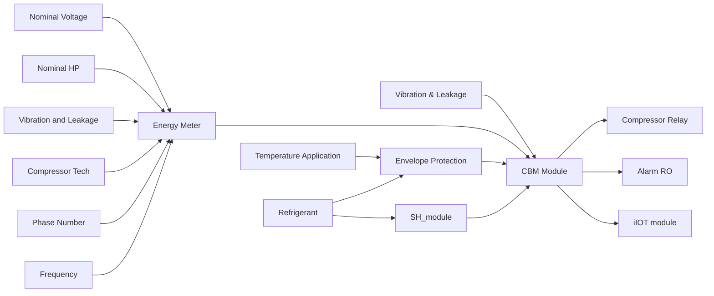

# Symbionte UN
iot-HVAC&R protection module based on ESP32 to Azure IoT Central using the Azure SDK for C Arduino library

## Abstract
This project addresses the problem of correct diagnosis of compressors for air conditioning and refrigeration systems, using instrumentation easily found in the global market in order to be low-cost, accessible and easy to assembly and diagnose, for all kind of users. For this work, the use of an Espressif ESP32 controller compatible with Arduino language and connected to Microsoft Azure is proposed, as well as algorithms based on trends that provide to different users, basic and advanced, with real-time knowledge of relevant variables and failures detected in the refrigeration process allows anticipating them under an enhanced condition-based maintenance scheme, reducing incorrect diagnoses and system downtime while improve capabilities for a better failure troubleshooting, control over spare parts and the reduction of spoiled product. Also, in order to massify this solution, this device can be used as an input with system data to generate relevant information to a recurrent neural network which diagnose, not only compressors but the complete system as well, under two significant variables which are coefficient of performance and mass flow.

## Scope
After doing research about maintenance techniques in air conditioning and refrigeration systems, it was possible to determine critical variables that affects optimal performance in refrigeration and air-conditioning key components, more exactly, the compressor.
- Electrical values: Compression system is coupled to an electric motor that is cooled (many times) by the refrigerant substance.
  - Power supply parameters (Voltage)
  - Consumption parameters (Current)
  - Efficiency measurement (Power and power factor)
- Thermodynamic values: The compressor increases the pressure (due to the reduction in volume) to transport refrigerant gas through the pipeline.
  - Since a pressure/temperature drop across the TXV/EXV (Thermostatic or Electronic Expansion Valve) is essential to the system.
  - Measurement of superheat and avoid liquid returns or migrations to the compressor.
  - Knowing the efficiency of the compressor based on the COP/EER (Coefficient of Performance/ Energy Efficiency Ratio)
- Vibration and CO2 levels: This approach seeks to measure signs of excessive vibration and levels of displacement of the CO2 level to estimate the possibility of refrigerant leakage in the compressor or surrounding systems.

**Total completion time**:  4 hours (included calibration)

## References
[1]	T. Birmpili, “Montreal protocol at 30: The governance structure, the evolution, and the kigali amendment,” Comptes Rendus Geoscience, vol. 350, no. 7, pp. 425–431, 2018.

[2]	U. N. E. Programme, “The kigali amendment to the montreal protocol: Hfc phase-down,” United Nations Environment Programme, Nairobi, Kenya, Tech. Rep., 2016. [Online]. Available: https://wedocs.unep.org/ bitstream/handle/20.500.11822/25495/Kigali Amend eng.pdf

[3]	A. Koons-Stapf, “Condition based maintenance: Theory, methodology, application,” 01 2015, pp. 1–35.

[4]	D. L. Pinzon Ni´ no, “Panorama de aplicaci˜ on de internet de las cosas´ (iot),” 2016.

[5]	A. A. Kader, “Increasing food availability by reducing postharvest losses of fresh produce,” in V International Postharvest Symposium 682, 2004, pp. 2169–2176.

[6]	T. Stuart, Waste: Uncovering the global food scandal. WW Norton & Company, 2009.

[7]	R. S. Rolle, “Improving postharvest management and marketing in the asia-pacific region: issues and challenges,” Postharvest management of fruit and vegetables in the Asia-Pacific region, vol. 1, no. 1, pp. 23–31, 2006.

[8]	J. Gustavsson, C. Cederberg, U. Sonesson, R. Van Otterdijk, and A. Meybeck, “Global food losses and food waste,” 2011.

[9]	Nelson Sierra, “Symbionte UN,” GitHub repository, 2022. [Online]. Available: {https://github.com/nasierras/Symbionte UN}

[10]	H. Air-Conditioning and R. Institute, “2020 standard for performance rating of positive displacement refrigerant compressors,” in AHRI Standard 540, march 2020, pp. 6–23.

[11]	J. Chaudhary and A. Mishra, “Detection of gas leakage and automatic alert system using arduino,” SSRN Electronic Journal, 01 2019.

[12]	“Mechanical vibration — measurement and evaluation of machine vibration — part 8: Reciprocating compressor systems,” International Organization for Standardization, Geneva, CH, Standard, Mar. 2018.

[13]	M. Corporation, “Arduino sdk cloud azure development for arduino,” https://github.com/Azure/azure-sdk-for-c-arduino, 2013.

[14]	S. Nan, “Thingesp cloud client library,” Sep 2021. [Online]. Available: https://github.com/SiddheshNan/ThingESP-Arduino-Library

[15]	N. Tudoroiu, M. Zaheeruddin, E.-R. Tudoroiu, and V. Jeflea, “Fault detection and diagnosis (fdd) in heating ventilation air conditioning systems (hvac) using an interactive multiple model augmented unscented kalman filter (immaukf),” 2008 Conference on Human System Interactions, pp. 334–339, 2008.

[16]	National Electrical Manufacturers Association (NEMA), “Nema standards publication mg 1-2020: Motors and generators,” NEMA, Rosslyn, VA, Technical Report MG 1, 2020. [Online]. Available: https://www.nema.org/Standards/Pages/Motors-and-Generators.aspx

[17]	J. Smith and M. Johnson, “Effects of voltage and current unbalance on the performance and efficiency of three-phase induction motors,” IEEE Transactions on Industry Applications, vol. 51, no. 2, pp. 987–996, 2015.

[18]	Z. Soltani, K. K. Sørensen, J. Leth, and J. D. Bendtsen, “Fault detection and diagnosis in refrigeration systems using machine learning algorithms,” International Journal of Refrigeration, vol. 144, pp. 34– 45, 2022. [Online]. Available: https://www.sciencedirect.com/science/ article/pii/S0140700722002997

[19]	Y. Ust, “Performance analysis and optimization of irreversible air refrigeration cycles based on ecological coefficient of performance criterion,” Applied Thermal Engineering, vol. 29, no. 1, pp. 47–55, 2009.

[20]	H. Air-Conditioning and R. Institute, “2012 standard for performance rating of positive displacement carbon dioxide refrigerant compressors and compressor units,” in AHRI Standard 571, march 2012, pp. 6–23.

[21]	Y. Cengel and M. Boles, Thermodynamics: An Engineering Approach, ser. Cengel series in engineering thermal-fluid sciences. McGraw-Hill, 2011.

[22]	E. Winandy, C. Saavedra, and J. Lebrun, “Experimental analysis and simplified modelling of a hermetic scroll refrigeration compressor,” Applied thermal engineering, vol. 22, no. 2, pp. 107–120, 2002.

[23]	D. Adelekan, O. Ohunakin, and B. Paul, “Artificial intelligence models for refrigeration, air conditioning and heat pump systems,” Energy Reports, vol. 8, pp. 8451–8466, 2022.
